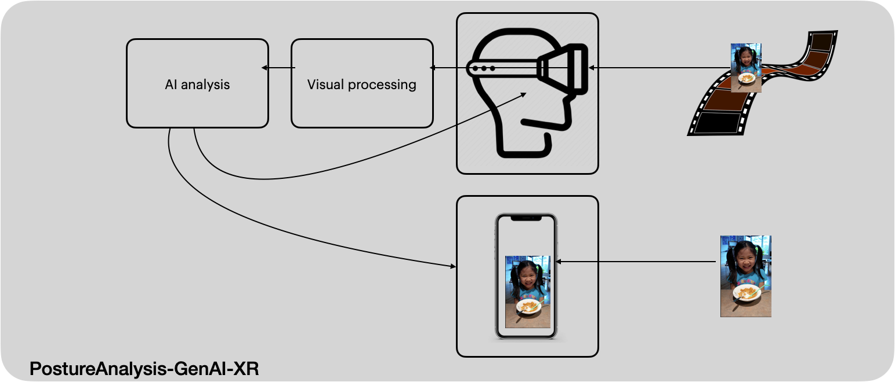

# PostureAnalysis-GenAI-XR
This is not just a feature; it's a paradigm shift in posture analysis, integrating artificial intelligence and virtual reality to provide a holistic understanding of body language and emotional responses, an innovative solution that combines cutting-edge Artificial Neural Networks (ANN) and Extended Reality (XR) technologies. Harnessing the power of artificial intelligence and extended reality to provide unparalleled insights into body language and microexpressions in real-time.

- Preliminary test feedback from "testmicroexpressions.png": The image shows a young girl sitting at a table with a plate of food in front of her, likely at home based on the domestic setting. She is smiling broadly with her teeth visible, and her eyes are slightly squinted, which commonly indicates genuine joy or happiness. This expression could be classified as a "Duchenne smile," a sign of a spontaneous, genuine emotional response. Her hair is styled in pigtails with green accessories, and she's wearing a "Hello Kitty" shirt, suggesting an interest in popular children's characters or themes. Her posture is upright and leaning slightly forward, which can suggest eagerness or enthusiasm. The food on the plate appears to be cereal, and there is a spoon in the bowl, suggesting she may be about to eat or is in the process of eating. Overall, the behavioral cues of the girl indicate a moment of happiness, potentially excitement about the meal or general contentment. Microexpressions are fleeting facial expressions that occur within a fraction of a second and reveal underlying emotions. In a still image, it is challenging to analyze microexpressions because they are dynamic and transient; however, the girl's broad smile and the twinkling, slightly crinkled eyes in a static context suggest a positive emotional state.

